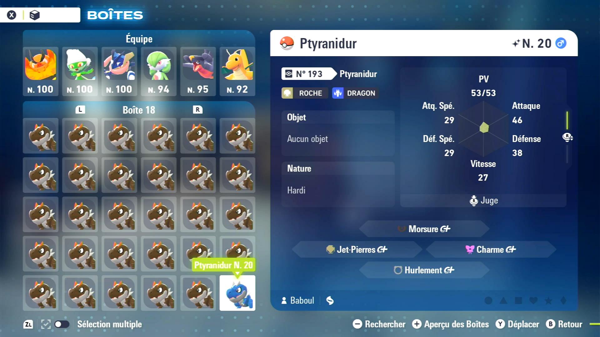

# Auto Fossil (In Beta, Not Released Yet)

## Program Description

Hunt alpha and/or shiny fossil Pokémon by repeatedly reviving them and checking them in box.

### Instructions

1. Face toward the fossil researcher Reg in the Pokémon lab and have the button A visible.
2. Ensure your party is FULL to let all revived fossils go into box.
3. The current and following boxes are EMPTY. The exact number of boxes to leave empty depends on how many fossils you want to revive in one go.
4. SAVE the game.
5. Start the program in the game.

## Options

### How Many Fossils to Revive Before Checking Them in Box

How many fossils to revive in one go before checking whether they are shiny and/or alpha in box. The more fossils you revive in one go, the more efficient the program is. Fossil shiny chance is not affected by the shiny charm. So we would want every little speed we can get.

### Which Fossil to Choose in the Dialog Menu

Choose which fossil in the dialog menu with Reg.

### Stop On

Choose what the program stops on:

- Stops on a shiny fossil Pokémon
- Stops on an alpha fossil Pokémon
- Stops on a shiny or an alpha fossil Pokémon
- Stops on a shiny alpha fossil Pokémon

### Take a Video When Found

Press the video record button on Switch when found a match.

### Go Home When Done

When program finishes, whether to go to Switch home screen.

## Credits

- **Author:** Gin

**Discord Server:** 

