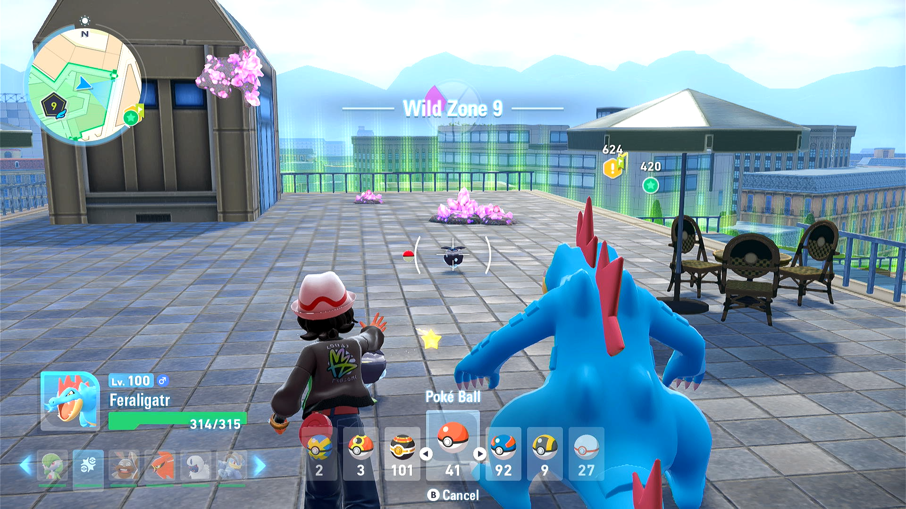

# Post-Kill Catcher (In Beta, Not Released Yet)

## Program Description

After you knock out a Pokémon, immediately save in front of it. This will allow you to retry catching it until you succeed.

While this program is intended for catching a knocked out Pokémon, it can be used for anything saved in front of you.

### Instructions

1. Save in front of a knocked out Pokémon.
2. Start the program in the game.

The program will throw a ball at the whatever it locks on to. Then it will reset the game and repeat.

This is not a smart program that will automatically stop and notify you when the catch succeeds. Instead, it relies on the fact that the game will auto-save on a catch. Therefore you will need to manually check on the program and stop it if the catch was successful. This is fine because this is not a program that run for a long time.

## Options

### Pokéball Right-Scrolls

Scoll this many balls to the right. Negative will scroll to the left.

Keep in mind that each time you reset the game, the ball order will be reset to their natural order. Sorting by favorites does not persist across saves!

### Scoll Hold, Scroll Release, Post-Throw Wait

These are timing parameters. You should not need to adjust these.

## Credits

- **Author:** Kuroneko/Mysticial

**Discord Server:** 

