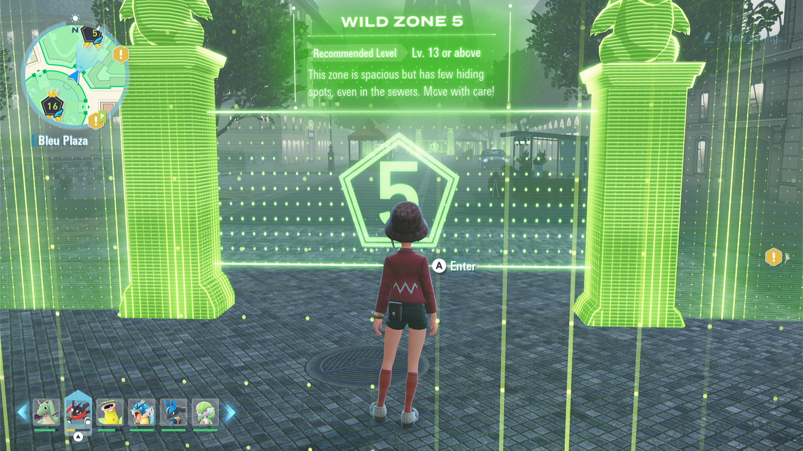
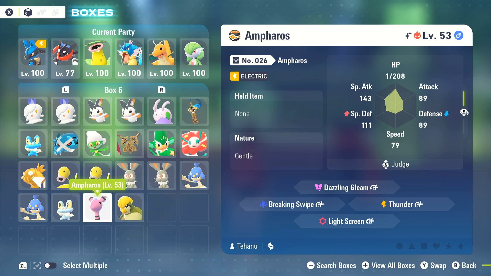
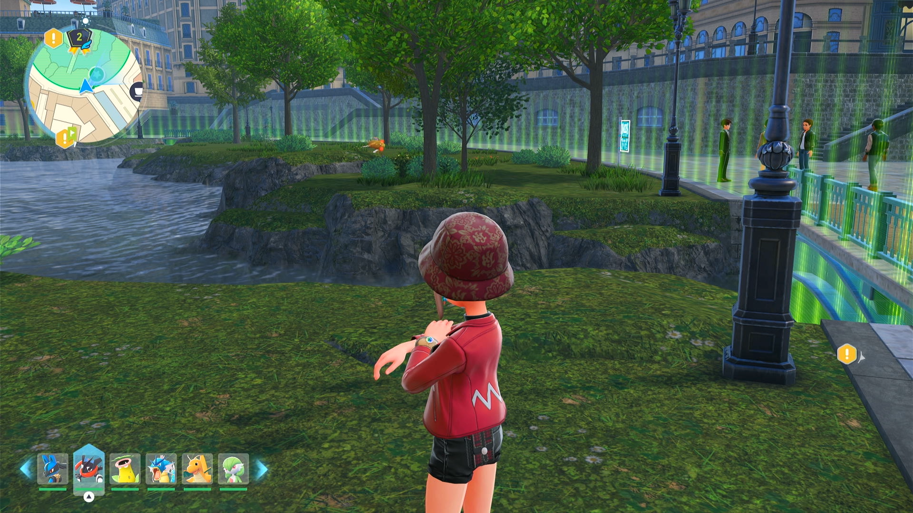
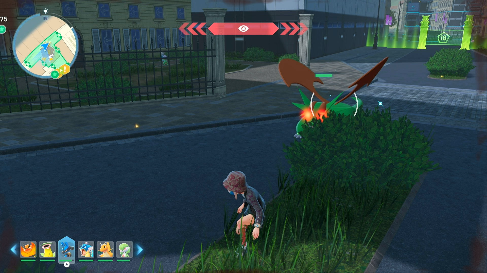

# Shiny Hunt - Wild Zone Entrance

## Program Description

Shiny hunt by repeatedly walking into a wild zone and flying back to the entrance. This will shiny hunt all spawns within 50m of the entrance and further if you set to also walk forward in zone for a short period of time. Since this program will move your character into the zone, it's not appropriate for some zones (e.g. *Zone 19*). And to avoid being target by Pokemon near the entrance, walking in the zone should be as short as possible.

With Shiny Charm you'll get a shiny quite fast if there are many Pokemon spawn in the range. So you should not let it run for too long to avoid some shiny getting overwritten/discarded by the game.

This program would detect the day/night change. When such change occurs, the program would try to recover after the cutscene.

Shiny sound detection will happen at most once since in this game the shiny is saved and repeatedly detect (most likely) the same shiny is pointless.

### Instructions

1. Place your character in front of the entrance and face it.
2. Start the program in the game.

### Appropriate Zones
- Zone 1
- Zone 2
    - Alpha Magikarp and Alpha Staryu
- Zone 3
- Zone 5
    - best one; you can hunt both Zone 5 and northeast part of Zone 16 (Alpha Ampharos and Froakie)
- Zone 6
- Zone 7
- Zone 8
- Zone 11
- Zone 12
- Zone 13
    - night only; Alpha Trevenant in range
- Zone 15
- Zone 16
    - your favorate Froakie
- Zone 17
    - Chespin
- Zone 18
    - Alpha Salamence
- Zone 20
    - Totodile, Squirtle

### Inappropriate Zones
- Zone 4
    - very likely get caught by Gastly or Honedge
- Zone 9
    - seems nothing within the range
- Zone 10
    - if the 2 Slowpoke become Alpha
- Zone 13
    - day only; Vivillon spawns very close and Alpha chance not low
- Zone 14
    - Aron near the entrance
- Zone 19
    - guardian Kangaskhan

## Options

### WALK IN ZONE duration

After passing through the entrance, you can increase the spawn radius by walking this long forward in the zone.

### Shiny Sound Detected Action

When a shiny sound is heard, perform one of the following actions:

- Stop program and go Home. Send notification.
- Keep running. Notify on first shiny sound only. (default)

Do not choose *Keep running. Notify on all shiny sounds*.

### Take a Video

Record a video of the encounter. This will happen each time a notification is sent. So be careful if you are notifying on all shiny sounds as this may lead a lot of recorded videos of the same shiny.

## Credits

- **Author:** Saͥbͣeͫr👑Ⰰ/naussika

**Discord Server:** 

